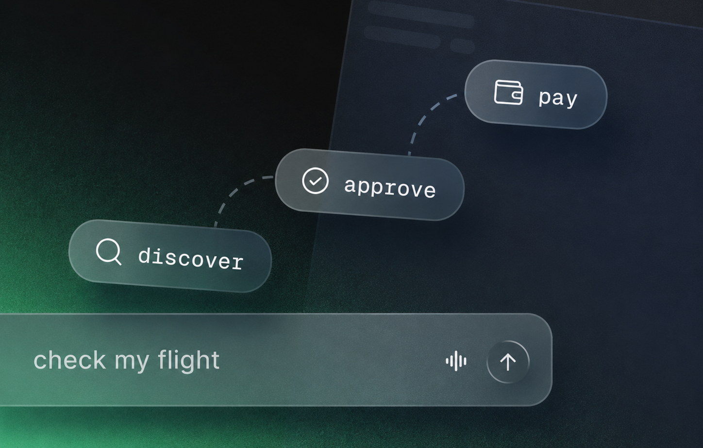

# Circle Payment Agent

An AI agent with its own USDC wallet that discovers and pays for services on demand. It uses the [Circle Agent Stack](https://developers.circle.com/agent-stack) to search the [Circle Agent Marketplace](https://agents.circle.com/services), estimate the cost, request approval, and pay per call, without subscriptions, API keys, or account signups. Built with [Mastra](https://mastra.ai).

## Why we built this

Agents stop at paywalls, missing API keys and account signups, and the usual answer is to go and set one up for every service you might need. This template shows the other shape: the agent is handed a wallet and a marketplace, so a blocker becomes a purchase it can make while you watch.

## Features

- Pays per call in USDC on the Circle Agent Marketplace, with no subscription or API key
- Finds the service itself: searches, inspects and prices the request before it spends
- Every spend suspends for your approval in Studio, and nothing is charged until you resume it
- Signs in to Circle from the chat, taking the Terms as an approval and the emailed code as a reply
- A separate wallet and workspace per caller, so one deployment can serve more than one person

## Quick start

### 1. Clone the template

```bash
npx create-mastra@latest --template circle-payment-agent
cd circle-payment-agent
```

### 2. Add your API keys

```bash
cp .env.example .env
```

Fill in `OPENAI_API_KEY`. That is the only key you need, and you can swap in [any model](https://mastra.ai/models/environment-variables) with that provider's key instead.

Circle needs no account and no API key. You accept Circle's Terms and paste an emailed code in the chat, and the agent installs the [Circle CLI](https://developers.circle.com/agent-stack/circle-cli/command-reference) itself.

### 3. Start the dev server

```bash
pnpm run dev
```

Open [Mastra Studio](http://localhost:4111), select **Circle Payment Agent**, and ask `what services are available for weather data?`. The agent installs the Circle CLI and Circle's [skills](https://github.com/circlefin/skills), walks you through signing in, then comes back with marketplace listings and their per-call prices.

## Demo

<video src="https://github.com/akelani-circle/mastra-circle-payment-agent/raw/main/assets/demo.mp4" controls></video>

[Watch the demo](https://github.com/akelani-circle/mastra-circle-payment-agent/raw/main/assets/demo.mp4) — the agent finds a paid service, prices the call, and waits for approval before it spends.

This demo runs in Mastra Studio, but you can connect this agent to your React, Next.js, or Vue app using the [Mastra Client SDK](https://mastra.ai/docs/server/mastra-client) or agentic UI libraries like [AI SDK UI](https://mastra.ai/guides/build-your-ui/ai-sdk-ui), [CopilotKit](https://mastra.ai/guides/build-your-ui/copilotkit), or [Assistant UI](https://mastra.ai/guides/build-your-ui/assistant-ui).

## Making it yours

Change the model with `AGENT_MODEL` in `.env`. Change what stops for you in `src/mastra/approval.ts`, which holds the commands that spend, the ones only you can run, and the install that would write skills where the agent never reads them.

Each caller gets its own home directory, keyed by the `user-id` it sends (`src/mastra/tenancy.ts`), so swap that for whatever your app already uses to identify a user.

## Before you leave it running

Everything on none of the lists in `src/mastra/approval.ts` runs unprompted, so the agent can delete files, install packages and fetch from anywhere. The real ceiling is not in the code: set per-transaction, daily, weekly and monthly caps on the wallet with `circle wallet limit set` and they hold whatever the agent is persuaded to do. That one is yours to run, since it confirms by one-time code.

Nothing here checks that a caller is who it says it is, so put something in front that authenticates before you expose this to anyone else.

This is a sample app for demonstration and educational purposes only, and not production-ready. It signs in to Circle on mainnet and can spend real USDC.

## About Mastra templates

[Mastra templates](https://mastra.ai/templates) are ready-to-use projects that show off what you can build. Clone one, try it in Studio, and adapt it to your use case.

The agent's instructions and every command it runs come from Circle's [skills](https://github.com/circlefin/skills) and [setup document](https://agents.circle.com/skills/setup.md), fetched and installed at runtime.

Want to contribute? Open an issue or a pull request on [akelani-circle/mastra-circle-payment-agent](https://github.com/akelani-circle/mastra-circle-payment-agent).
